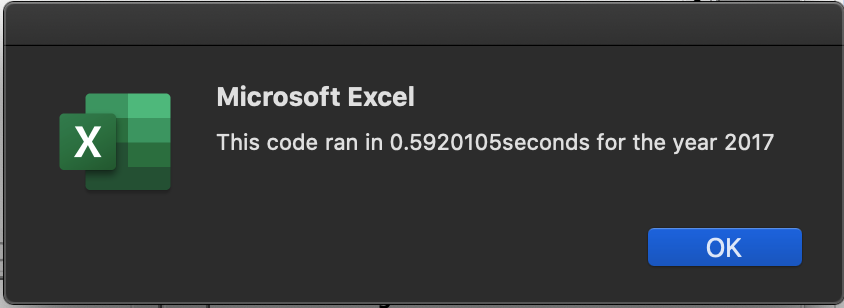
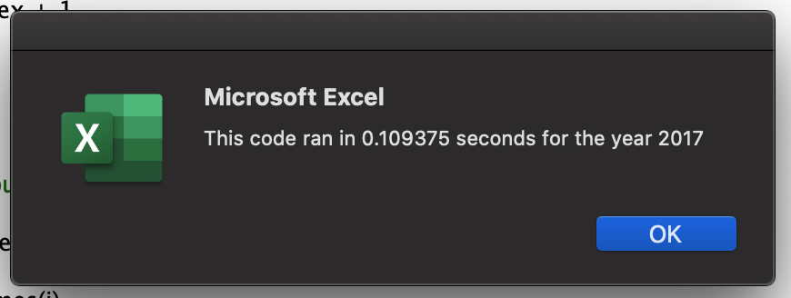
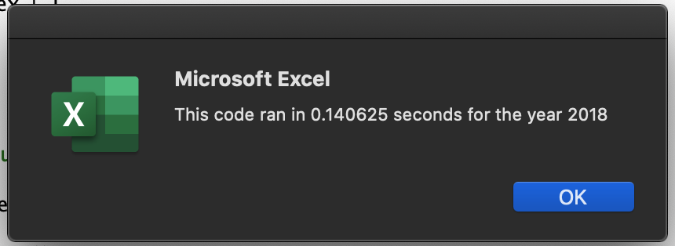

# stock-analysis

## Project Overview
### *Purpose*
The purpose of this project is to analyze stocks from multiple companies to determine the overall performance of each stock for a given year. The stocks included in this analysis are from companies in the alternative/green energy sector. The endpoints used to measure performance include total daily volume, which can be used to calcuate how many stocks are traded on average each day, and percent return, an indicator of the money made or lost on an investment over the course of a year. 

### *Script Goals*
The original script written to execute this analysis loops through the data once for each stock. This works for our dataset because there are relatively few stocks, but if this script was used for a much larger dataset with more stocks, the analysis may be lengthy and potentially exceed the computing power available. Our goal is to refactor this code so that the script loops through the dataset once total instead of once per stock, which will shorten the length of time needed and reduce the amount of computing power required. 

## Results
This dataset included stock performance for 12 companies over 2 years: 2017 and 2018. Refactoring the original code reduced the amount of time needed to execute the analysis for both years by at least 60%. 

### *2017 Stocks*
#### Original Run Time

#### Refactored Run Time

### *2018 Stocks*
#### Original Run Time

#### Refactored Run Time

## Summary
### *Advantages and Disadvantages of Refactoring*
For the purpose of this analysis, refactoring code was done to shorten the length of time and computing power required to analyze a dataset. Refactoring code can involve advantages and disadvantages depending on the application.

#### Advantages
 1. Refactoring can reduce the complexity of code, making it more readable and easier to   understand for other users reading the script.

 2. Refactoring can also help other programmers find hidden bugs due to the increased readability.

#### Disadvantages
 1. Making changes to the fundamental structure of code is necessary when refactoring, and this may inadvertently cause the code to function differently. Though this is fixable, it may require time and effort in order to resolve the issue. 
 
  2. Because refactoring code can take time to ensure that functionality is not lost, this should not be done on a time crunch if there is little time to test the refactored code. 

### *How do these factors apply to refactoring the original VBA Script?*
Refactoring the original script in this project made for a simpler and more elegant code that is visually easier to understand. It also significantly reduced analysis time, and thus computing power. 

The act of restructuring however, was challenging and doing so in VBA made it difficult to pinpoint where mistakes were being made. The errors given when debugging were unclear and the location of the error did not necessarily indicate the line of code causing the issue. This meant that we had to comment out blocks of code one at a time to find where the bug was located. 

## Final Remarks
Refactoring code for this project increased the capacity for analysis so that in the future, larger datasets can be analyzed in a more efficient manner.  
